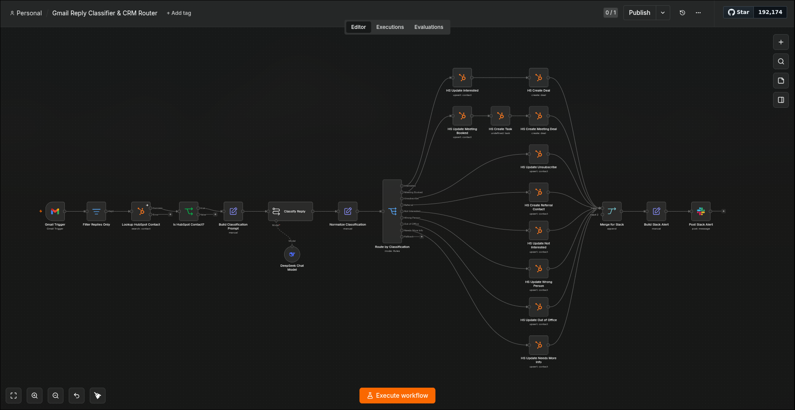

# Gmail Reply Classifier & CRM Router

## Demo Video

[](https://www.youtube.com/watch?v=jd1gciIHBGo)

---

## Workflow Overview



---

## What It Does

This workflow monitors the connected Gmail inbox every minute for new emails. When an email
comes in, an AI model (DeepSeek) reads the body and classifies the intent into one of eight
categories. Based on the classification, it automatically updates the sender's HubSpot contact
record, creates deals or tasks where appropriate, and posts a Slack alert summarizing what
action was taken — all without any human in the loop.

Only emails from senders who already exist as HubSpot contacts are processed — unrecognised
senders are dropped silently.

This closes the outreach loop: leads go out via Instantly, replies come back, and the CRM
stays updated automatically.

## Note on Trigger (Gmail Trigger vs Instantly Webhook)

The production design for this workflow would use an **Instantly webhook** — Instantly fires a
reply event in real time regardless of which sending address or campaign the original email came
from, making it the correct solution for multi-inbox outreach setups.

However, **Instantly webhooks require a paid plan**. For this demo the trigger is a
**Gmail Trigger** that polls the inbox every minute. This means the workflow only monitors one
inbox, but it demonstrates the full classification and CRM routing logic identically to how it
would work in production.

In a real multi-inbox setup, replacing the Gmail Trigger with a Webhook node pointed at
Instantly is a single node swap — the rest of the pipeline is unchanged.

## Reply Classifications & CRM Actions

| Classification | HubSpot Action | Deal Created? |
|---|---|---|
| Interested | Update contact (lead status: Opportunity) | Yes — Appointment Scheduled stage |
| Meeting Booked | Update contact (Opportunity) + create Task | Yes — Presentation Scheduled stage |
| Unsubscribe | Update contact (lead status: Unqualified) | No |
| Referral | Upsert contact (lead status: In Progress) | No |
| Not Interested | Update contact (lead status: Unqualified) | No |
| Wrong Person | Update contact (lead status: Unqualified) | No |
| Out of Office | Update contact (lead status: In Progress) | No |
| Needs More Info | Update contact (lead status: In Progress) | No |
| Unrelated | Skip — no CRM action taken | No |

## Node-by-Node Flow

```
Gmail Trigger (polls every minute)
  → Filter Replies Only         — drops emails that are not replies (no "Re:" subject / In-Reply-To header)
  → Lookup HubSpot Contact      — fetches contact record by sender email
  → Is HubSpot Contact?         — drops the email if sender is not a known contact
  → Build Classification Prompt — constructs the AI prompt with email body and classification instructions
  → Classify Reply (chainLlm + DeepSeek)  — returns one of 9 classification labels
  → Normalize Classification    — extracts label, sender name, sender email into clean fields
  → Route by Classification (Switch node)
      → Interested         → HS Update Contact → HS Create Deal (Appt. Scheduled) → Merge
      → Meeting Booked     → HS Update Contact → HS Create Task → HS Create Meeting Deal (Presentation Scheduled) → Merge
      → Unsubscribe        → HS Update Contact (Unqualified) → Merge
      → Referral           → HS Upsert Contact (In Progress) → Merge
      → Not Interested     → HS Update Contact (Unqualified) → Merge
      → Wrong Person       → HS Update Contact (Unqualified) → Merge
      → Out of Office      → HS Update Contact (In Progress) → Merge
      → Needs More Info    → HS Update Contact (In Progress) → Merge
      → Unrelated (fallback) → (skipped, no action)
  → Merge for Slack
  → Build Slack Alert     — formats message with sender, classification, and action taken
  → Post Slack Alert      — sends to configured Slack channel
```

## How It Fits Into the System

This workflow is **Stage 3** of the three-workflow sales pipeline:

1. **AI Lead Enrichment Pipeline** — finds and enriches leads, saves to Google Sheet
2. **Sheet → HubSpot + Instantly** — loads leads into HubSpot and enrolls them in Instantly
   email campaigns
3. **This workflow** — monitors for replies, classifies intent with AI, and updates HubSpot
   and Slack automatically

This is the most autonomous workflow in the system. Stages 1 and 2 are scheduled and
somewhat mechanical. This workflow is fully reactive — it listens continuously and responds
to unpredictable human replies with contextual CRM updates and deal creation.

Together, the three workflows represent a complete, self-operating top-of-funnel: from
zero leads to a classified, CRM-updated pipeline, with no manual data entry at any stage.

## Credentials Required

| Service | Credential Type | What It's Used For |
|---|---|---|
| Gmail | `gmailOAuth2` | Polling the inbox for new emails |
| DeepSeek | `deepSeekApi` | Classifying reply intent with AI |
| HubSpot | `hubspotAppToken` | Looking up contacts, updating records, creating deals/tasks |
| Slack | `slackApi` | Posting classification and action alerts |

**Difficulty to run without credentials:** Moderate. Gmail OAuth is straightforward but the
inbox needs to be receiving emails from people who already exist as HubSpot contacts — otherwise
every email gets dropped at the contact lookup step. DeepSeek requires an API key. Slack needs
an OAuth connection with the bot invited to the target channel.

For a demo: ensure the sender's email address exists as a HubSpot contact first, then send
a plain email (no "Re:" needed for the demo trigger) to the monitored inbox — the workflow
will pick it up within one minute and classify it live.

## Demo Notes

- The workflow is set to `active: false` — activate it in n8n for a live demo
- Make sure the sender email exists as a HubSpot contact before testing, otherwise the lookup
  drops the email silently
- Send a test email to the monitored inbox with a clear intent (e.g. "Yes, I'd love to learn
  more — let's find a time to chat") and watch the execution log classify it and create a deal
- Show the HubSpot contact record updating in real time after the workflow runs
- Show the Slack alert arriving with the classification and action summary
